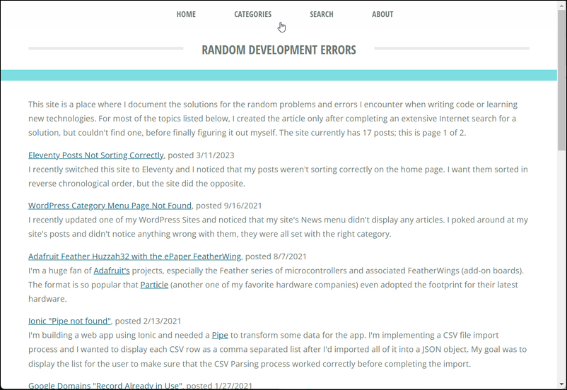

# Random Development Errors (Eleventy)

[](https://app.netlify.com/sites/random-errors/deploys)

The Eleventy version of the static web site for [randomerrors.dev](https://randomerrors.dev).  This is a work in progress.



Based on: https://cfjedimaster.github.io/eleventy-blog-guide/guide.html

+ Domain: [Google Domains](https://domains.google)
+ Framework: [Eleventy](https://www.11ty.dev/)
+ Source: [Github](https://github.com/johnwargo/random-errors-11ty)
+ Hosting: [Netlify](https://app.netlify.com/sites/random-errors/overview)
+ Backdoor Access: [Random Errors](https://randomerrors.netlify.app/)

## Tasks

* [x] Select theme and implement
* [x] Categories menu
* [x] Update contact options
* [x] Add number of pages and buttons to pagination
* [x] Add Buy me a coffee
* [x] Add Favicons
* [x] Publish site to Netlify
* [x] Add Google Analytics
* [x] Switch DNS
* [ ] Add Site Search (Algolia)
* [ ] Add Discussions (?)

## Google Analytics

* Random Errors-GA4
* Property ID: 311016183
* Measurement ID: G-ZWB41V4FM5


```javascript
<script type="text/javascript" src="https://cdnjs.buymeacoffee.com/1.0.0/button.prod.min.js" data-name="bmc-button" data-slug="johnwargo" data-color="#5F7FFF" data-emoji="☕"  data-font="Poppins" data-text="Buy me a Coffee" data-outline-color="#000000" data-font-color="#ffffff" data-coffee-color="#FFDD00" ></script>
```

```html
<br/>
<p>If this article helps you, please consider
<a href="https://www.buymeacoffee.com/johnwargo" target="_blank"></a>
</p>
```